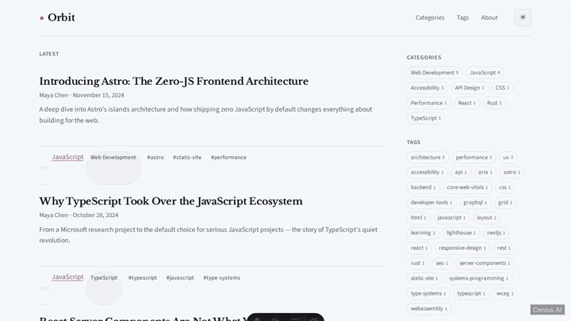
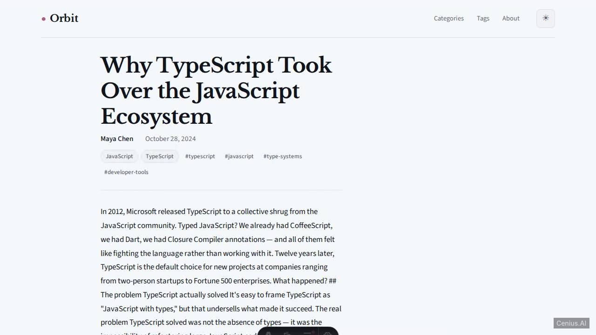
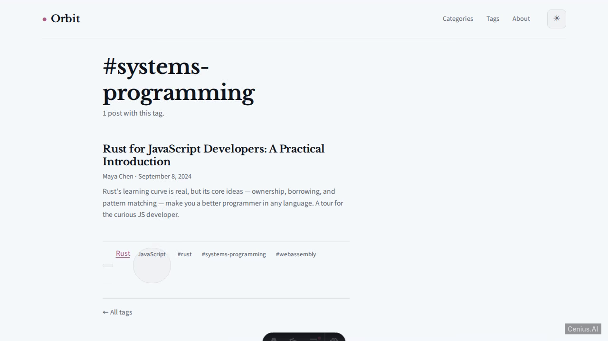
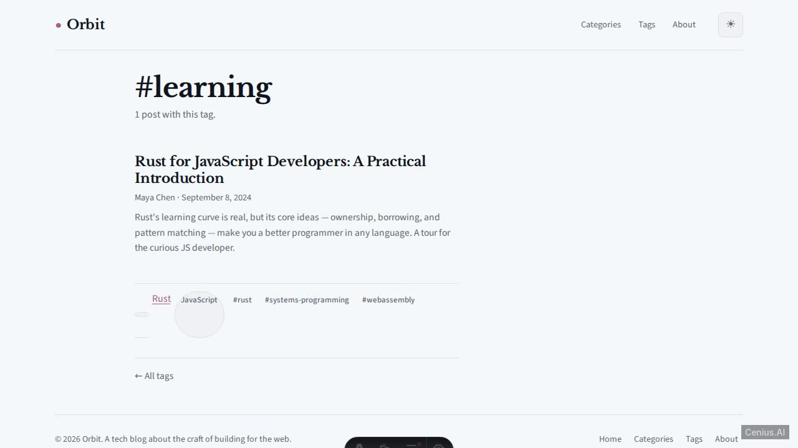

# Orbit CMS — open-source blog platform

**Orbit CMS** is a free, open-source blog platform built with Astro. A polished, modern tech blog / publishing CMS built with Astro and TypeScript, featuring content collections for posts, categories, and tags. Run it locally, deploy it as a self-hosted blog platform, or [remix it on cenius.ai](https://cenius.ai/marketplace/p/orbit-cms?ref=gh&utm_campaign=orbit-cms-astro) to make it your own — the whole application (code, design, seeded demo data) ships in this repository under the MIT license.

[](LICENSE)  [](https://cenius.ai)

## Demo



▶ **[Watch the full demo video](https://cenius.ai/marketplace/p/orbit-cms?ref=gh&utm_campaign=orbit-cms-astro)** — the complete walkthrough, playing on the project's cenius.ai page · [MP4 file](.github/media/demo.mp4)

## Screenshots

  

## Features

- List posts on home page
- View single post
- Filter posts by category
- Filter posts by tag
- Category and tag index pages
- Light/dark theme toggle
- Responsive design
- Seeded demo data
- Static JSON API endpoints

## Quick start

```bash
./install.sh   # installs dependencies + seeds demo data
```

See [`INSTALL.md`](INSTALL.md) for full setup and usage instructions.

## Usage guide

### Browsing the Site

Once the development server is running (`npm run dev`), open your browser to the displayed URL (usually `http://localhost:4321`).

#### Available Routes

| Route | Description |
|-------|-------------|
| `/` | Homepage – latest posts, category/tag sidebar |
| `/about` | About the blog, its philosophy, and technology |
| `/categories` | All categories with post counts |
| `/categories/:slug` | Posts filtered by a specific category (e.g. `/categories/javascript`) |
| `/tags` | All tags with post counts |
| `/tags/:slug` | Posts filtered by a specific tag (e.g. `/tags/rust`) |
| `/posts/:slug` | Individual post (e.g. `/posts/why-typescript`) |

#### Theme Toggle

Click the theme toggle button in the header to switch between light and dark mode. The preference respects your operating system setting by default.

### Writing Content

Blog posts are Markdown files located in `src/content/posts/`. Each file must include frontmatter metadata.

#### Example Frontmatter

```markdown
---
title: "My New Post"
date: 2025-04-01
excerpt: "A short summary for preview cards."
author: "Author Name"
categories:
  - JavaScript
  - TypeScript
tags:
  - tutorial
  - web-development
image: "/my-post-cover.jpg"
draft: false
---

Your content here...
```

- `title` – post heading
- `date` – publication date (`YYYY-MM-DD`)
- `excerpt` – shown on cards and SEO
- `author` – displayed author name
- `categories` – array of category names
- `tags` – array of tag strings
- `image` – optional cover image path
- `draft` – set to `true` to hide from production builds

_Full guide: [`USAGE.md`](USAGE.md)_

## Architecture

Astro application, delivered as a complete, runnable project (43 files). Top-level layout: `public/`, `src/`. `install.sh` provisions dependencies and seeds demo data, so the app boots with something to show. Setup details live in [`INSTALL.md`](INSTALL.md).

## FAQ

### What does it take to self-host Orbit CMS?

Everything you need ships in this repo: clone it, run `./install.sh` to install dependencies and seed demo data, then follow [`INSTALL.md`](INSTALL.md) to start it. No external services required.

### Is white-labeling Orbit CMS allowed?

Yes — and the easiest way is [remixing it on cenius.ai](https://cenius.ai/marketplace/p/orbit-cms?ref=gh&utm_campaign=orbit-cms-astro): modifications made on the platform come with full rebrand and relicense rights over your derivative.

### Is there a no-code way to modify Orbit CMS?

Yes — [load it on cenius.ai](https://cenius.ai/marketplace/p/orbit-cms?ref=gh&utm_campaign=orbit-cms-astro), describe the change in plain English, and you get back a new downloadable build with the modification applied.

### What powers Orbit CMS under the hood?

Orbit CMS is a Astro application — and this repository holds the complete, runnable source, not a stripped-down sample. Highlights include list posts on home page.

### Is Orbit CMS free for commercial use?

Yes. The code is MIT-licensed — use it, modify it, and ship it commercially. See [LICENSE](LICENSE).

## License & rebranding

Released under the [MIT License](LICENSE) (© 2026 Cenius AI) — free for personal and commercial use.

**Need a customized version?** [Remix this app on cenius.ai](https://cenius.ai/marketplace/p/orbit-cms?ref=gh&utm_campaign=orbit-cms-astro) — modifications made on the platform come with **full rebrand & relicense rights** over your derivative.

## Built with cenius.ai

This entire application — code, design, seeded demo data — was generated on **[cenius.ai](https://cenius.ai)** from a plain-English description.

- 🚀 [Build your own app on cenius.ai](https://cenius.ai)
- 🎛️ [Remix Orbit CMS on the marketplace](https://cenius.ai/marketplace/p/orbit-cms?ref=gh&utm_campaign=orbit-cms-astro) — open it in a workspace, prompt for changes, and ship your own version.

More open-source apps: [the Cenius-ai catalog](https://github.com/Cenius-ai) · [showcase index](https://github.com/Cenius-ai/showcase)
